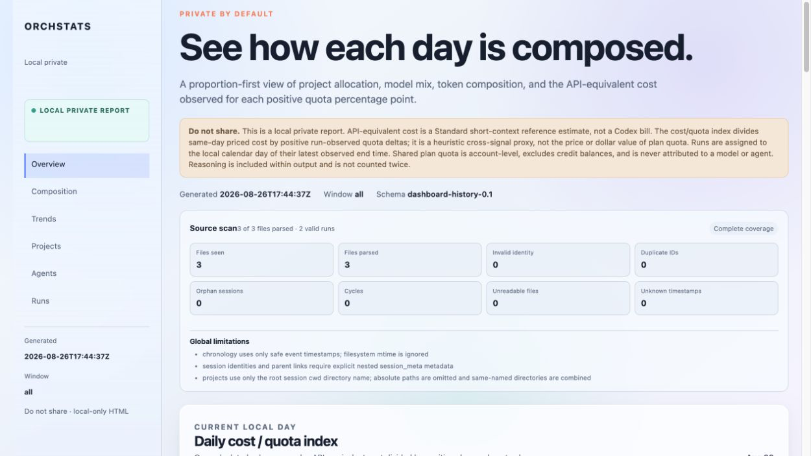
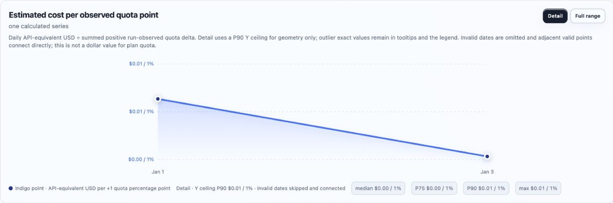
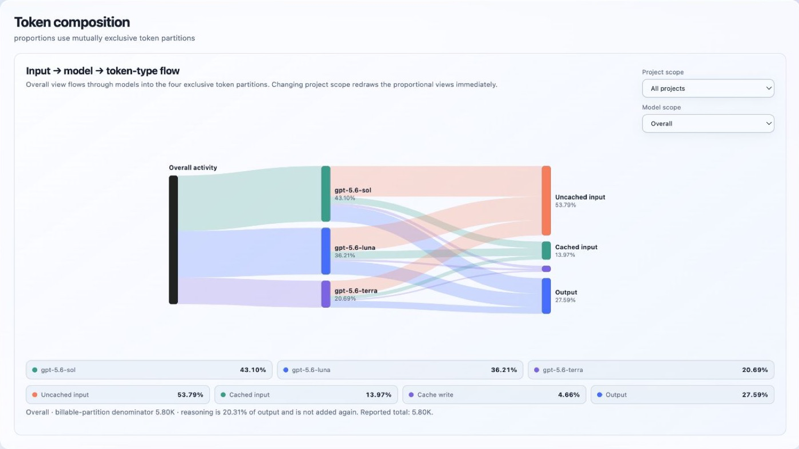
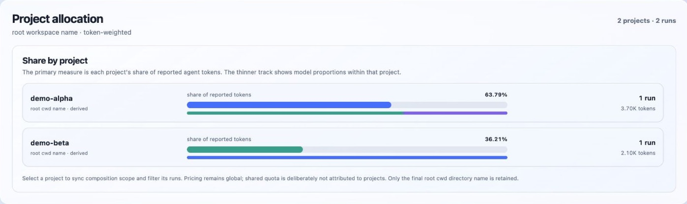
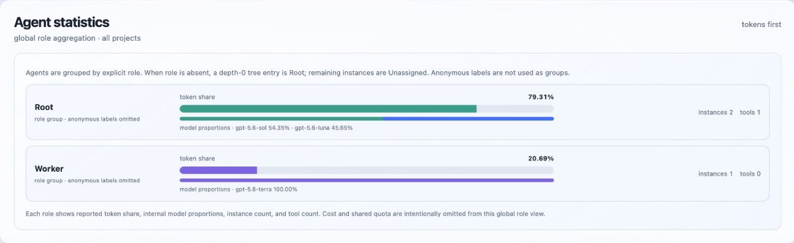
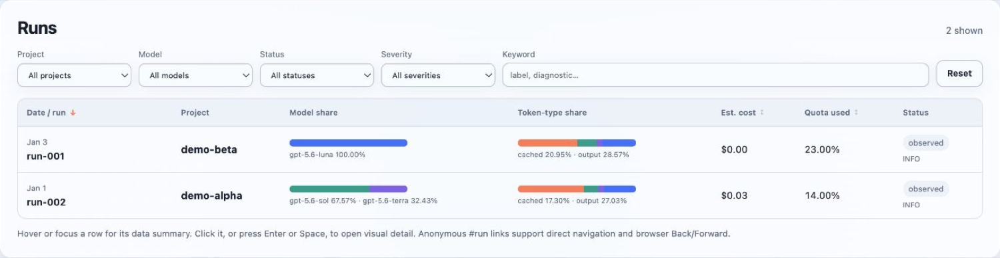

# codex-orchstats

A local HTML dashboard for viewing Codex orchestration usage, quota changes, and API-equivalent cost estimates. Developed with Codex.

## Preview

Dashboard overview:



Price and quota changes:



Token and model composition:



Project allocation:



Agent statistics:



Run details:



## Install

Requires Python 3.9+ on macOS or Linux.

```sh
git clone https://github.com/yuysky/codex-orchstats.git
cd codex-orchstats
pipx install .
```

## Run

Try the built-in demo:

```sh
orchstats dashboard --demo
```

Generate a dashboard from all local Codex history (the default):

```sh
orchstats dashboard
```

Choose a time window explicitly when needed:

```sh
orchstats dashboard --since 24h
orchstats dashboard --since 7d
orchstats dashboard --since 30d
orchstats dashboard --since all
```

If your Codex sessions are stored somewhere else, pass their directory explicitly:

```sh
orchstats dashboard --sessions-root /path/to/codex/sessions
```

## Find the HTML

The dashboard opens automatically in your browser. The command also prints the full HTML path:

```text
Dashboard: /path/to/orchstats-dashboard.html
```

To save it somewhere specific:

```sh
orchstats dashboard --output ~/Desktop/orchstats.html --no-open
```

Then open `~/Desktop/orchstats.html` in any browser.
